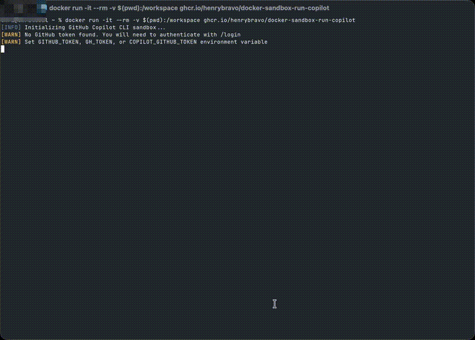

# Docker Sandbox Template for GitHub Copilot CLI

[](https://github.com/github/copilot-cli)
[](https://github.com/henrybravo/docker-sandbox-run-copilot/pkgs/container/docker-sandbox-run-copilot)
[](https://opensource.org/licenses/MIT)

A Docker sandbox template for running [GitHub Copilot CLI](https://github.com/github/copilot-cli) in an isolated environment, similar to how Docker supports Claude Code and Gemini CLI via `docker sandbox run`.

## ⚠️ Status: Waiting on Docker Support

**Current limitation:** Docker's `docker sandbox run` command validates agent names against a hardcoded list (`claude`, `gemini`) before processing the `--template` flag:

```bash
$ docker sandbox run --template ghcr.io/henrybravo/docker-sandbox-run-copilot copilot
invalid agent: copilot (must be one of: claude, gemini)
```

This means the `--template` flag alone cannot add new agents - Docker needs to add `copilot` to their supported agents list.

### 📬 Requests Submitted

We have requested Docker to add GitHub Copilot CLI support:

| Channel | Status | Link |
|---------|--------|------|
| GitHub Issue | 🟢 Acknowledged | [docker/cli#6734](https://github.com/docker/cli/issues/6734) |
| Docker Feedback | 🟡 Submitted | coding-sandboxes-feedback@docker.com |

> **Update:** Docker team acknowledged the request and is investigating. The sandbox plugin is closed-source, but they're looking into adding Copilot support.

**You can help!** Star/upvote the GitHub issue and add your voice to show community demand.

### ✅ What Works Now

While waiting for native support, you can use this template with `docker run`:

```bash
docker run -it --rm \
  -v $(pwd):/workspace \
  -e GITHUB_TOKEN="your-token" \
  ghcr.io/henrybravo/docker-sandbox-run-copilot
```



<details>
<summary>Click to play full video</summary>

https://github.com/user-attachments/assets/68afaabf-3f0a-4e61-a1c1-8ca99fcbcf10

</details>

## 🎯 Purpose

Docker Desktop 4.50+ introduced `docker sandbox run` which allows running AI coding agents (Claude Code, Gemini CLI) in isolated containers. This project provides a compatible template for GitHub Copilot CLI, enabling you to:

- Run Copilot CLI in a secure, isolated environment
- Protect your host system from unintended changes
- Use the same familiar workflow as other Docker sandboxed agents

## 📋 Prerequisites

- Docker Desktop 4.50+ (for `docker sandbox` support)
- A GitHub account with an active [Copilot subscription](https://github.com/features/copilot)
- GitHub Personal Access Token (PAT) with "Copilot Requests" permission

## 🚀 Quick Start

### Option 1: Using Docker Sandbox (Recommended)

```bash
# Run Copilot CLI in your current directory
docker sandbox run --template ghcr.io/henrybravo/docker-sandbox-run-copilot copilot

# Run in a specific workspace
docker sandbox run --template ghcr.io/henrybravo/docker-sandbox-run-copilot \
  --workspace ~/my-project \
  copilot
```

### Option 2: Using Docker Run (Standalone)

```bash
# Interactive mode
docker run -it --rm \
  -v $(pwd):/workspace \
  -e GITHUB_TOKEN="your-token" \
  ghcr.io/henrybravo/docker-sandbox-run-copilot

# With a prompt
docker run -it --rm \
  -v $(pwd):/workspace \
  -e GITHUB_TOKEN="your-token" \
  ghcr.io/henrybravo/docker-sandbox-run-copilot \
  "explain what this codebase does"
```

### Option 3: Build Locally

```bash
# Clone the repository
git clone https://github.com/henrybravo/docker-sandbox-run-copilot.git
cd docker-sandbox-run-copilot

# Build the image
docker build -t copilot-sandbox .

# Run
docker run -it --rm \
  -v $(pwd):/workspace \
  -e GITHUB_TOKEN="your-token" \
  copilot-sandbox
```

## 🔐 Authentication

GitHub Copilot CLI requires authentication with your GitHub account. There are several ways to provide credentials:

### Method 1: Environment Variable (Recommended)

```bash
# Set your GitHub PAT with Copilot Requests permission
export GITHUB_TOKEN="ghp_xxxxxxxxxxxxxxxxxxxx"

# Run the sandbox
docker sandbox run --template ghcr.io/henrybravo/docker-sandbox-run-copilot \
  -e GITHUB_TOKEN="$GITHUB_TOKEN" \
  copilot
```

### Method 2: Interactive Login

If no token is provided, Copilot CLI will prompt you to authenticate:

```bash
docker sandbox run --template ghcr.io/henrybravo/docker-sandbox-run-copilot copilot
# Then use /login command inside Copilot CLI
```

### Method 3: Persistent Credentials Volume

```bash
# Create a credentials volume
docker volume create copilot-credentials

# Save your token
echo "ghp_xxxxxxxxxxxx" | docker run -i --rm \
  -v copilot-credentials:/mnt/copilot-data \
  alpine sh -c "cat > /mnt/copilot-data/.github_token"

# Run with mounted credentials
docker run -it --rm \
  -v $(pwd):/workspace \
  -v copilot-credentials:/mnt/copilot-data \
  ghcr.io/henrybravo/docker-sandbox-run-copilot
```

### Creating a GitHub PAT for Copilot

1. Go to [GitHub Personal Access Tokens](https://github.com/settings/personal-access-tokens/new)
2. Create a fine-grained PAT
3. Under "Permissions", click "Add permissions"
4. Select "Copilot Requests" (read and write)
5. Generate and save your token

## 🛠️ Configuration

### Environment Variables

| Variable | Description | Required |
|----------|-------------|----------|
| `GITHUB_TOKEN` | GitHub PAT with Copilot Requests permission | Yes (or use /login) |
| `GH_TOKEN` | Alternative to GITHUB_TOKEN | No |
| `COPILOT_GITHUB_TOKEN` | Alternative token variable | No |
| `GIT_USER_NAME` | Git user.name for commits | No |
| `GIT_USER_EMAIL` | Git user.email for commits | No |
| `WORKSPACE_PATH` | Override default workspace path | No |

### Passing Options to Copilot CLI

All arguments after `copilot` are passed directly to Copilot CLI:

```bash
# Pass a prompt directly
docker sandbox run --template ghcr.io/henrybravo/docker-sandbox-run-copilot \
  copilot "fix the bug in main.py"

# Add directory context
docker sandbox run --template ghcr.io/henrybravo/docker-sandbox-run-copilot \
  copilot --add-dir /workspace/src

# Enable debug logging
docker sandbox run --template ghcr.io/henrybravo/docker-sandbox-run-copilot \
  copilot --log-level debug
```

## 📦 What's Included

The sandbox image includes:

- **GitHub Copilot CLI** (`@github/copilot`) - Latest version
- **Node.js 22 LTS** - JavaScript runtime
- **GitHub CLI** (`gh`) - For GitHub operations
- **Docker CLI** - For Docker-in-Docker scenarios
- **Python 3** - For MCP servers and tools
- **Go** - Common development language
- **Git** - Version control
- **Development tools** - ripgrep, jq, vim, nano, tree, etc.

## 🔧 Advanced Usage

### Docker-in-Docker

To give Copilot CLI access to Docker commands:

```bash
docker sandbox run --template ghcr.io/henrybravo/docker-sandbox-run-copilot \
  --mount-docker-socket \
  copilot
```

> ⚠️ **Warning**: This grants full Docker daemon access. Use only with trusted code.

### Custom MCP Servers

Copilot CLI supports MCP (Model Context Protocol) servers. You can add custom servers:

```bash
# Inside Copilot CLI, use /mcp command to manage servers
/mcp add playwright
/mcp add github
```

### Mounting Additional Volumes

```bash
docker sandbox run --template ghcr.io/henrybravo/docker-sandbox-run-copilot \
  -v ~/datasets:/data:ro \
  -v ~/models:/models \
  copilot
```

### Using a Different Model

```bash
docker sandbox run --template ghcr.io/henrybravo/docker-sandbox-run-copilot \
  -e COPILOT_MODEL=gpt-5 \
  copilot
```

## 🏗️ Building Custom Images

Extend this template for your specific needs:

```dockerfile
FROM ghcr.io/henrybravo/docker-sandbox-run-copilot:latest

# Add your custom tools
RUN npm install -g typescript ts-node

# Add custom MCP servers
RUN npm install -g @playwright/mcp@latest

# Pre-configure additional settings
COPY my-config.json /home/agent/.config/copilot/
```

## 🛠️ Local Development

### Using Makefile (Recommended)

The project includes a `Makefile` for common development tasks:

```bash
# Build the Docker image
make build

# Run interactive shell in the container
make run

# Test that the image builds and tools are installed
make test

# Clean up images and containers
make clean

# Show all available commands
make help
```

### Using Docker Compose

For persistent development environments, use `docker-compose.yml`:

```bash
# Copy environment template and configure
cp .env.example .env
# Edit .env with your GITHUB_TOKEN

# Start the sandbox in background
docker compose up -d

# Enter the running container
docker compose exec copilot bash

# Stop the sandbox
docker compose down
```

Docker Compose provides:
- Persistent volumes for Copilot CLI config and state
- Environment variables from `.env` file
- Easy workspace mounting

## 🤝 Contributing

Contributions are welcome! Please feel free to submit issues and pull requests.

### Development Workflow

```bash
# Clone the repo
git clone https://github.com/henrybravo/docker-sandbox-run-copilot.git
cd docker-sandbox-run-copilot

# Build and test locally
make build
make test

# Run with your project mounted
make run
```

## 📄 License

MIT License - see [LICENSE](LICENSE) for details.

## 🙏 Acknowledgments

- [Docker](https://www.docker.com/) for the sandbox infrastructure
- [GitHub](https://github.com/) for Copilot CLI
- Inspired by Docker's official `docker/sandbox-templates:claude-code` implementation

## 📚 Related Resources

- [GitHub Copilot CLI Documentation](https://docs.github.com/en/copilot/concepts/agents/about-copilot-cli)
- [Docker Sandboxes Documentation](https://docs.docker.com/ai/sandboxes/)
- [MCP (Model Context Protocol)](https://github.com/mcp)

---

## TODO

- [ ] Add GitHub Action to auto-update README badge when `.copilot-version` changes

---

**Note**: This is a community project and is not officially affiliated with Docker, Inc. or GitHub, Inc.
